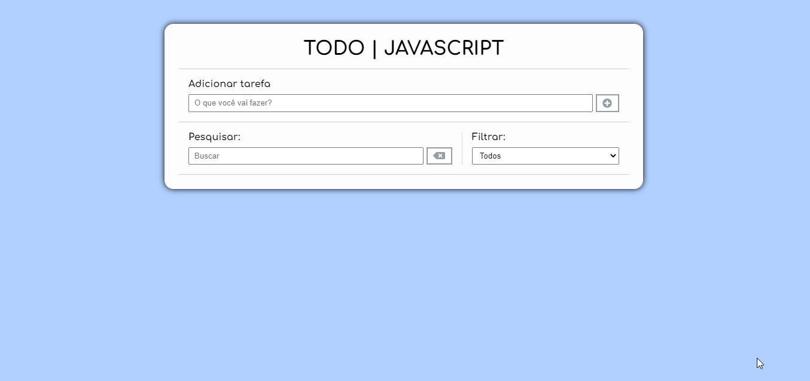

# Auxiliar de estudos | 

## Seja Bem-vindo(a) !!

Obrigado por visitar meu perfil! :0

##  🚀 O projeto    🚀
***

Os TO-DO são excelentes formas de treinarmos e praticamos nossos conhecimentos na parte de desenvolvimento web. Neste projeto em especifico foi utilizado apenas HTML, CSS e JavaScript sem a utilização de qualquer framework ou biblioteca.

## O que é um TO-DO?
***

 São listas de tarefas que vem com o objetivo de te ajudar a cumprir pequenos ou grandes objetivos, sejam eles de curto, médio ou longo prazo. Ter uma lista como está nos permite ao final do dia de forma tangível, visualizar quanto daquilo que objetivamos foram concluídos e também facilitará que tarefas que por algum motivo não foram finalizadas não sejam esquecidas no futuro.

### Como utilizar?
***

No campo <b>“adicionar tarefa”</b> o usuário deve criar um item para ser adicionado à lista de tarefas, não sendo possível a adição de itens vazios, após isso será possível clicar no botão <b>“adicionar”</b> fazendo a inclusão do mesmo ou até mesmo pressionado a tecla <b>ENTER</b>.
Quando um item é adicionado à lista, ele será sinalizado como pendente através da cor AZUL e contará com três opções de manipulação:
<ul>
<li><b>Concluir:</b> O item ficará rasurado e mudara de cor para cinza;</li>
<li><b>Editar:</b> será aberto um novo campo que permitirá a alteração no item desejado;</li>
<li><b>Remover:</b> ao ser clicado, o item será excluído da lista.</li>
</ul>

Também será permitido a busca por itens específicos ou até mesmo realizar a exibição apenas de itens pendentes, concluídos ou ambos.
 

  

  

  <a href="https://todojs-afj.netlify.app/"><b>Clique Aqui</b></a>

 

### Habilidades utilizadas 💻👨🏻‍💻🖥

 
  <ul>
    <li> HTML &nbsp;&nbsp;&nbsp;&nbsp;&nbsp;&nbsp;&nbsp;&nbsp;&nbsp;&nbsp; </li>
   <li> CSS &nbsp;&nbsp;&nbsp;&nbsp;&nbsp;&nbsp;&nbsp;&nbsp;&nbsp;&nbsp;&nbsp;&nbsp;  </li>
   <li> JavaScript &nbsp;&nbsp;  </li>
    </ul>

 
